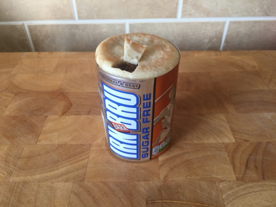

Let’s hope we don’t get in any copyright trouble over this one, but it was too good not to do some day…

Let’s turn two of Scotland’s favourite ingredients into a pie-filled ‘can’ of Irn Bru - in a challenge to make an iconic image…

## Method

To do this, you need 4 of Bell’s finest mini Scotch Pies and a mid-sized bottle of Irn Bru.  Clearly Pie Nation worries for the nation’s health so we’ve gone for the Sugar Free variety.

Stack 3 of the pies…

Tear the label off the bottle (note: not using a glass one here, nothing to do with the money-return policy change, it’s just easier to peel them off plastic!)

And wrap around the 3-pie stack.  Then here it gets clever.

Take the fourth pie and a good sharp knife.

Cut the bottom off the pie, so you’ve got a nice round, flat edge to work with - and make sure you only cut enough to fill the gap at the top of the label.

Carefully place it in the top of the stack and start to cut a nice ring-pull-shaped hole.  From the crust, cut off a ‘tab’ to use later.

Place the tab in the back of the hole you just made, then adjust your camera to get just that right angle - and thus…

This might be our best one yet - enjoy and please share!